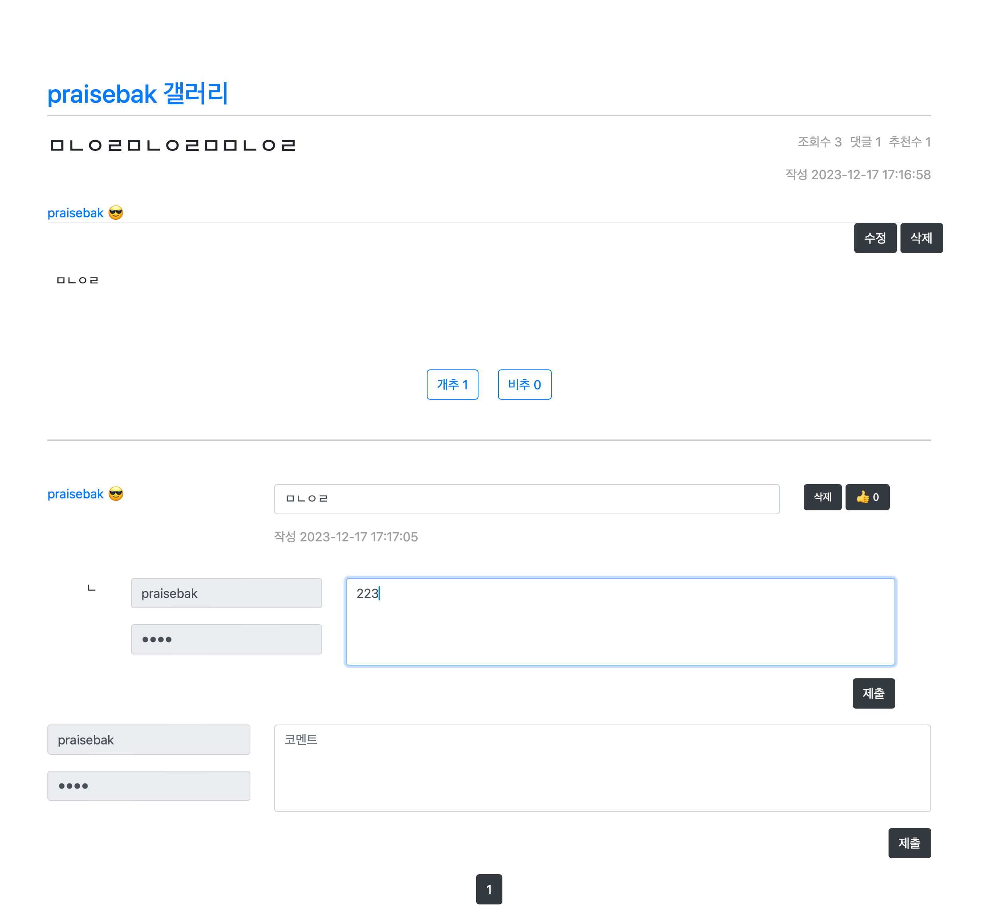

# 커뮤니티 사이트 Mindaces 펫 프로젝트

# 개요
스프링부트 처음 시작하는 공부겸 자신이 사용할만한 메모장 커뮤니티 웹사이트를 만들고 싶어서 시작하였습니다

## 사용 기술
- SpringBoot
  - JPA
  - OAuth2
  - Security
- Thymeleaf

## ERD

## 개발 기간
약 6개월

## 사용방법
- application-template.properties를 자신의 환경에 맞춰 작성한 뒤 application.properties로 수정해주세요

# 기능
## 커뮤니티 기능
- 익명,회원 글쓰기,삭제,수정
- 게시물 추천 등
- 게시물 작성 등(DaumOpenEditor 사용)
- 댓글
  - 중첩형 댓글
- 페이징
- 검색 기능
- 개념글
- 그 외 편의기능들 구현

## 추천게시물 로직
- 단순히 일정 개수의 추천을 받으면 추천하는게 아닌
- 전체 추천 게시물의 추천의 평균과 함께 1/3 이상의 댓글이 달린 경우만 추천

### 자기계발 기능
- 목표 추가,삭제,대표 목표 설정
    - 삭제는 여러개 선택해서 한번에 삭제할 수 있을 것
- 랜덤 명언 띄우기
- 날짜 추적

### 회원 기능
- 회원가입  
- 로그인
- 로그아웃
- 유저 정보 찾기
- 마이 페이지
  - 카테고리별로 자신이 적은 글 확인 가능
    - 게시물
    - 개념글
    - 댓글
- 메일 인증 기반 비밀번호 찾기
- 유저 검색(유저의 페이지 확인가능)

### 알람 기능
- SSE이용 글에 댓글등이 달렸을 때 알람

## 느낀점
- 펫 프로젝트에서 예외처리나 편의기능 구현은 크게 가치가 없을수도 있다
  (단순한 시간만사용한 구현 등)
- 새로운 기능들,라이브러리 등을 구현하는 것에서 여러 경험을 해보는 것을 목표로 하자
- 복잡도가 크면 클수록 명세서는 더욱 더 중요하다. 항상 설계가 구현의 토대가 되도록 시간을 써야한다
- 보안,예외처리들 중 일부는 Spring Security등의 설정으로 귀찮은 구현을 피할 수 있다(잘 사용하면 더욱 좋지 않을까?)
- 재활용되는 메소드들은 해당 상황에 국한하여 구현하지 말고 범용적으로 구현해야한다
- 이번 프로젝트에서는 How에 초점을 맞춰 하는 방법을 하나하나 찾아서 따라함. 
- 다음 프로젝트에서는 Why에 초점을 맞춰 제대로 이해하고 기반 지식을 쌓자
- 여러번 강조해도 부족하지 않을만큼 명세서,설계가 중요하다
- 부족한 이론부분을 다시 채워보자

## 개선사항
- 회원 탈퇴 기능 구현
- 비효율적인 기능들 (SSE)
- 몇가지 의문을 해결하지 못한 것들(구글 로그인 자동로그인 풀기 등)
- 아마존 웹 서비스에서 상용화